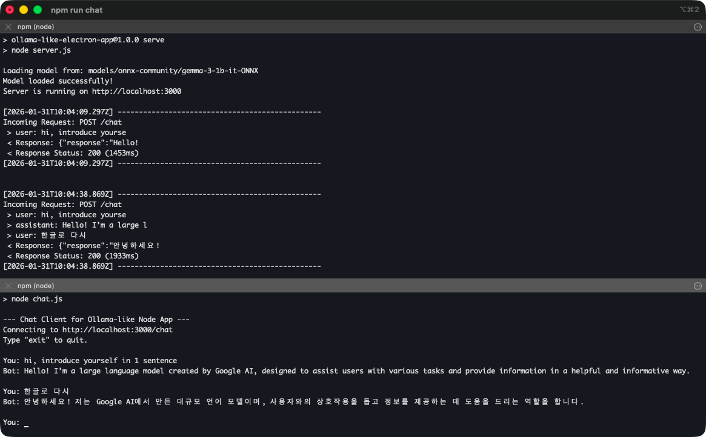

# Ollama-like Node.js App



<details>
<summary><strong>🇰🇷 Korean (한국어) - Click to expand</strong></summary>

# Ollama-like Node.js App

이 프로젝트는 로컬 환경에서 LLM(Large Language Model)을 실행하고 채팅할 수 있는 Node.js 애플리케이션입니다. Ollama와 유사하게 작동하며, ONNX Runtime을 통해 경량화된 모델을 효율적으로 구동합니다.

## 🚀 특징

- **로컬 서버**: Express.js 기반의 REST API 서버 (`server.js`)
- **CLI 채팅 클라이언트**: 터미널에서 바로 대화할 수 있는 클라이언트 (`chat.js`)
- **모델 다운로더**: 필요한 ONNX 모델을 자동으로 다운로드하는 스크립트 (`download-model.js`)
- **대화 기록**: 멀티턴 대화를 지원하여 이전 문맥을 기억합니다.

## 💡 ONNX를 사용하는 이유

이 프로젝트는 **ONNX (Open Neural Network Exchange)** 형식의 모델을 사용합니다. 그 이유는 다음과 같습니다:

1.  **효율적인 로컬 실행**: ONNX Runtime은 다양한 하드웨어(CPU, GPU 등)에서 최적화된 성능을 제공합니다. 특히 `q4`(4비트 양자화) 모델을 사용하여 메모리 사용량을 줄이면서도 준수한 성능을 냅니다.
2.  **프라이버시**: 모든 데이터 처리가 사용자의 컴퓨터 내에서 이루어지므로, 민감한 데이터가 외부 서버로 전송되지 않습니다.
3.  **비용 절감**: 외부 API(OpenAI, Anthropic 등)를 사용하지 않으므로 토큰 비용이 발생하지 않습니다.
4.  **호환성**: PyTorch나 TensorFlow로 학습된 모델을 표준 포맷으로 변환하여 다양한 환경에서 쉽게 배포하고 실행할 수 있습니다.

## 🛠️ 설치 및 설정 (Setup)

### 1. 사전 요구 사항
- Node.js (v18 이상 권장)
- npm

### 2. 패키지 설치
프로젝트 루트 디렉토리에서 의존성을 설치합니다.
```bash
npm install
```

### 3. 모델 다운로드
서버 실행 전, 사용할 ONNX 모델(`onnx-community/gemma-3-1b-it-ONNX`)을 다운로드해야 합니다.
```bash
npm run download
```
> 모델은 `./models` 디렉토리에 저장됩니다.

## 🖥️ 사용 방법 (Usage)

### 서버 실행
먼저 API 서버를 실행합니다. 서버는 3000번 포트에서 요청을 대기합니다.
```bash
npm run serve
```
*서버가 시작되면 모델을 로딩하며, "Model loaded successfully!" 메시지가 뜰 때까지 잠시 기다려야 할 수 있습니다.*

### 채팅 시작
새로운 터미널 창을 열고 CLI 채팅 클라이언트를 실행합니다.
```bash
npm run chat
```

## 📂 프로젝트 구조

- **`server.js`**: 메인 서버 파일입니다. Express 앱을 설정하고 `@huggingface/transformers`를 사용하여 모델을 로드 및 추론합니다.
- **`chat.js`**: 사용자의 입력을 받아 서버로 전송하고 응답을 출력하는 간단한 CLI 도구입니다.
- **`download-model.js`**: 지정된 ONNX 모델을 로컬에 다운로드하는 유틸리티 스크립트입니다.
- **`models/`**: 다운로드된 모델 파일이 저장되는 위치입니다.

## 🔌 API 명세

### `POST /chat`
채팅 메시지를 보내고 모델의 응답을 받습니다.

**Request Body:**
```json
{
  "messages": [
    { "role": "user", "content": "안녕하세요?" }
  ]
}
```
또는 단일 메시지:
```json
{
  "message": "안녕하세요?"
}
```

**Response:**
```json
{
  "response": "안녕하세요! 무엇을 도와드릴까요?"
}
```

</details>

---

This project is a Node.js application that allows you to run and chat with a Large Language Model (LLM) locally. It operates similarly to Ollama, efficiently driving lightweight models via ONNX Runtime.

## 🚀 Features

- **Local Server**: Express.js-based REST API server (`server.js`).
- **CLI Chat Client**: Terminal-based client for direct conversation (`chat.js`).
- **Model Downloader**: Script to automatically download the required ONNX model (`download-model.js`).
- **Conversation History**: Supports multi-turn conversations, remembering context.

## 💡 Why ONNX?

This project uses models in the **ONNX (Open Neural Network Exchange)** format. Here is why:

1.  **Efficient Local Execution**: ONNX Runtime offers optimized performance across various hardware (CPU, GPU, etc.). Using `q4` (4-bit quantization) models significantly reduces memory usage while maintaining decent performance.
2.  **Privacy**: All data processing happens locally on your machine. No sensitive data is sent to external servers.
3.  **Cost Saving**: No API fees (like OpenAI or Anthropic) are incurred as it runs on your hardware.
4.  **Compatibility**: Models trained in PyTorch or TensorFlow can be converted to this standard format for easy deployment across different environments.

## 🛠️ Setup

### 1. Prerequisites
- Node.js (v18 or higher recommended)
- npm

### 2. Install Dependencies
Install dependencies in the project root directory.
```bash
npm install
```

### 3. Download Model
Before running the server, you need to download the ONNX model (`onnx-community/gemma-3-1b-it-ONNX`).
```bash
npm run download
```
> The model will be saved in the `./models` directory.

## 🖥️ Usage

### Run Server
Start the API server first. It listens on port 3000.
```bash
npm run serve
```
*Once the server starts, it will load the model. Please wait until you see the "Model loaded successfully!" message.*

### Start Chat
Open a new terminal window and run the CLI chat client.
```bash
npm run chat
```

## 📂 Project Structure

- **`server.js`**: Main server file. Sets up the Express app and uses `@huggingface/transformers` to load and infer the model.
- **`chat.js`**: A simple CLI tool that takes user input, sends it to the server, and outputs the response.
- **`download-model.js`**: Utility script to download the specified ONNX model locally.
- **`models/`**: Directory where downloaded model files are stored.

## 🔌 API Specification

### `POST /chat`
Sends a chat message and receives the model's response.

**Request Body:**
```json
{
  "messages": [
    { "role": "user", "content": "Hello?" }
  ]
}
```
Or a single message:
```json
{
  "message": "Hello?"
}
```

**Response:**
```json
{
  "response": "Hello! How can I help you today?"
}
```

<br>

